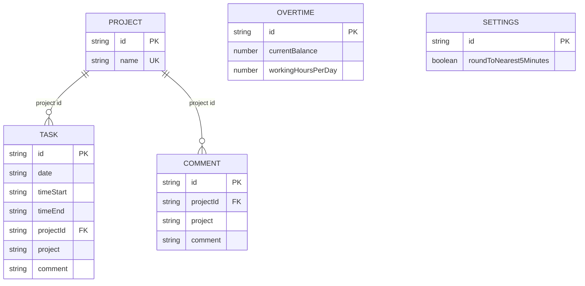

# Effortum Architecture

## Purpose

Effortum is a local-first time tracker. User data is persisted in IndexedDB via Dexie and mirrored in app state via Zustand.

## Main Architecture Pillars

1. Local-first persistence: all core data is stored in IndexedDB (Dexie), no backend required.
2. Single state layer: UI reads and writes through a centralized Zustand store.
3. Typed domain model: entities are defined as TypeScript model types in `src/models`.
4. Route-driven UI: TanStack Start + React pages and components organize interaction flows.
5. Validation and utility boundaries: input validation and date/time logic live in dedicated modules.
6. Test coverage by layer: Vitest for utilities/components, Playwright for end-to-end user flows.

## Entity Relationship Diagram

## Runtime Structure

- UI layer: routes (`src/routes`) render pages (`src/pages`) composed from reusable components (`src/components`), including the Projects page for project-name listing and future rename workflows.
- State layer: `src/store.ts` exposes actions and selectors for all user interactions.
- Persistence layer: `src/db.ts` defines Dexie schema versions and object stores.
- Domain layer: `src/models` contains strongly typed entities used across store and UI.
- Logic layer: `src/utils` contains date, time, and filtering behavior.

## Data Flow

1. UI events trigger store actions.
2. Store actions write/read Dexie tables.
3. Store refreshes in-memory state from persisted records.
4. React components re-render from Zustand state.

## Key Constraints

- Task-to-project and comment-to-project relations are canonical by project ID.
- Legacy project-name fields are kept during rollout for import/export compatibility and recovery.
- Overtime and settings are single-record entities identified by fixed IDs.
- Date filtering must normalize date-only and ISO datetime values for day-level comparisons.

## Documentation and Formatting

- Update files in `docs` whenever architecture or entity behavior changes.
- Markdown is formatted with Prettier using max line length 160 for prose; tables and diagrams are left structurally intact.
